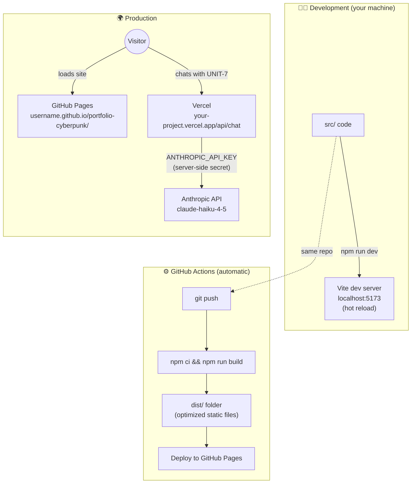
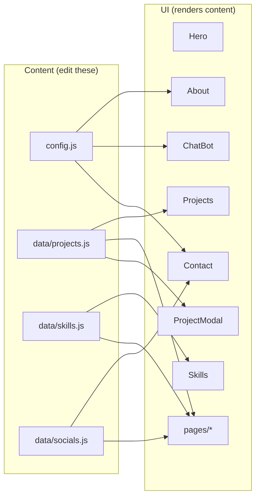

# Chapter 1 — The Big Picture

## What this project is

A single-page cyberpunk-themed portfolio website with:

- A **scrollable home page** (Hero → About → Skills → Projects → Contact)
- **Dedicated detail pages** for each section (`/about`, `/skills`, `/projects`, `/contact`)
- **Two switchable themes** (Cyber = cyan/magenta, Nebula = purple/teal)
- A **terminal-style project modal** that opens when you click a project card
- **UNIT-7**, a floating robot chatbot powered by Claude, that can answer questions, hand out your resume, and offer a Calendly link

## The tech stack, and why each piece

| Technology | What it does here | Why this one |
|---|---|---|
| **React 19** | Builds the UI out of reusable components | Component model fits a portfolio: each section is one self-contained file |
| **Vite** | Dev server + production bundler | Near-instant hot reload while developing; tiny fast builds |
| **react-router-dom (HashRouter)** | Client-side page navigation | Lets `/about` etc. work on GitHub Pages *without a server* (see Chapter 2) |
| **Framer Motion** | Animations (scroll reveals, hover scaling, modal springs) | Declarative — you describe the end state, it figures out the animation |
| **react-icons** | Every skill & social icon | One package, thousands of SVG icons, tree-shaken so only used icons ship |
| **Tailwind CSS v4** | Utility CSS (installed; most styling is actually inline + CSS variables) | Available for quick utilities |
| **@anthropic-ai/sdk** | Talks to Claude from the backend | Official SDK: retries, typed errors, auth handled for you |
| **GitHub Pages + Actions** | Hosts the site, rebuilds on every push | Free, zero-maintenance |
| **Vercel Functions** | Hosts the chatbot backend | Free tier; runs Node.js on demand; keeps the API key server-side |

## Repository map

```
Personal-Portfolio/
├── public/                      # Files served as-is (no processing)
│   ├── Artwork.png              #   Hero centerpiece image
│   ├── Apex.gif                 #   About-section avatar
│   ├── Resume.pdf               #   (you add this) chatbot's download button target
│   └── ...
├── src/                         # ── THE REACT APP ──
│   ├── main.jsx                 # Entry point: mounts <App/> into the HTML
│   ├── App.jsx                  # Routes + global layout (Navbar, Footer, ChatBot)
│   ├── index.css                # Design system: CSS variables, themes, effects
│   ├── config.js                # ⭐ YOUR settings: name, email, avatar, API URLs
│   ├── components/              # Reusable UI pieces used across pages
│   │   ├── Navbar.jsx           #   Fixed top nav + theme toggle button
│   │   ├── Footer.jsx           #   Bottom bar
│   │   ├── Avatar.jsx           #   Image-or-placeholder profile picture
│   │   ├── ChatBot.jsx          #   UNIT-7 (button + panel + teaser + API calls)
│   │   └── ProjectModal.jsx     #   Terminal-style project detail popup
│   ├── sections/                # Blocks of the SCROLLING HOME PAGE
│   │   ├── Hero.jsx             #   Landing screen w/ glitch artwork
│   │   ├── About.jsx / Skills.jsx / Projects.jsx / Contact.jsx
│   ├── pages/                   # FULL PAGES reached via the navbar
│   │   ├── AboutPage.jsx        #   Expanded bio + timeline + interests
│   │   ├── SkillsPage.jsx       #   Skills w/ proficiency bars
│   │   ├── ProjectsPage.jsx     #   Featured/other split + modal
│   │   └── ContactPage.jsx      #   Form + socials + quick info
│   ├── data/                    # ⭐ CONTENT lives here, separate from UI code
│   │   ├── projects.js          #   The 6 project records
│   │   ├── skills.js            #   Skill categories + brand colors
│   │   └── socials.js           #   Social links + icons
│   └── hooks/
│       └── useTheme.js          # Theme state + localStorage persistence
├── api/                         # ── THE BACKEND (runs on Vercel, NOT in browser) ──
│   ├── chat.js                  # POST /api/chat → validates → calls Claude
│   └── _lib/persona.js          # UNIT-7's system prompt (personality + facts)
├── .github/workflows/deploy.yml # CI: builds & publishes to GitHub Pages on push
├── vercel.json                  # Tells Vercel: no frontend build, just deploy api/
├── vite.config.js               # Vite config: base path, port, React dedupe fix
└── docs/                        # ← you are here
```

### The two golden rules of this layout

1. **Content is data, not markup.** Want to add a project? Edit `src/data/projects.js` — never touch the JSX. The UI components *render whatever is in the data files*. This separation means you can update your portfolio content without understanding React.

2. **`src/config.js` is the single place for personal settings** — name, email, avatar path, chatbot URL, Calendly link. One file to edit when anything about *you* changes.

## Full architecture



### Why is the backend separate from the site?

GitHub Pages can only serve **files** — it cannot run code. But the chatbot needs to:

1. Keep the `ANTHROPIC_API_KEY` **secret** (anything shipped to the browser is public — anyone can open DevTools and read it)
2. Enforce **rate limits** so a bot can't burn through your API credits
3. Filter **which websites** are allowed to call it (CORS)

So the one dynamic piece — `api/chat.js` — lives on Vercel, which runs it as a *serverless function*: no server to maintain, it just spins up for each request and disappears.

## Data flow in one picture



**Next:** [Chapter 2 — How the App Boots & Routes →](./02-boot-and-routing.md)
