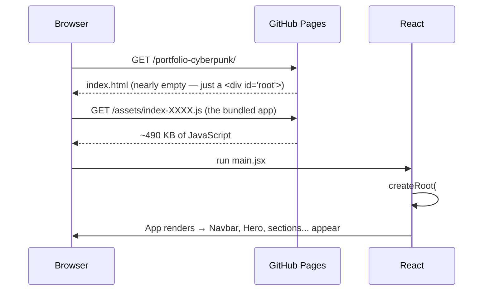
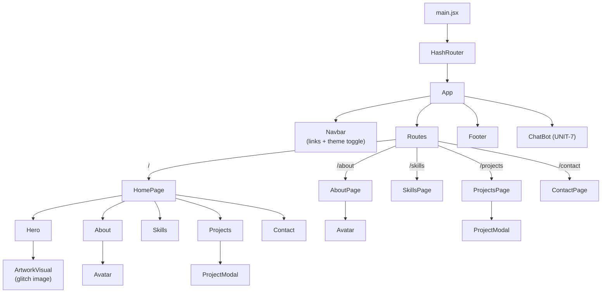
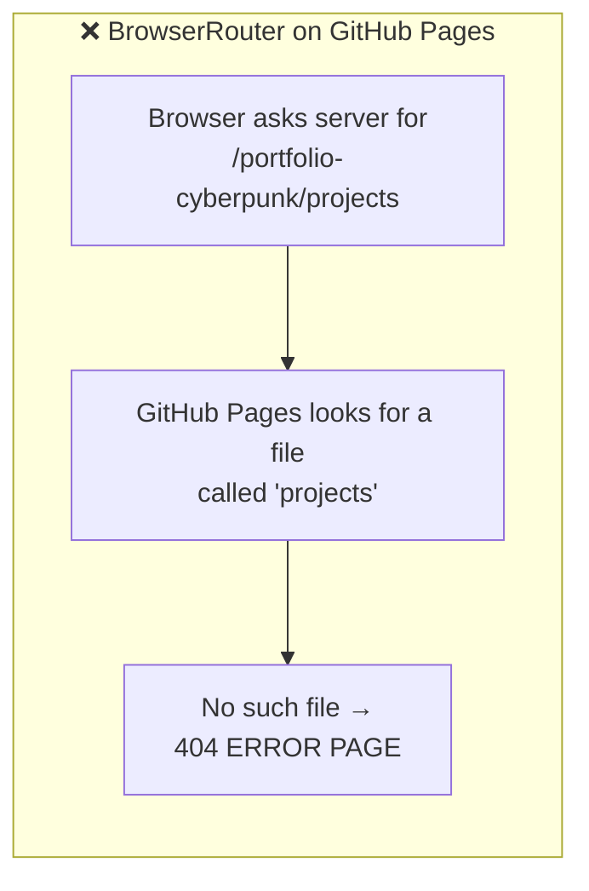
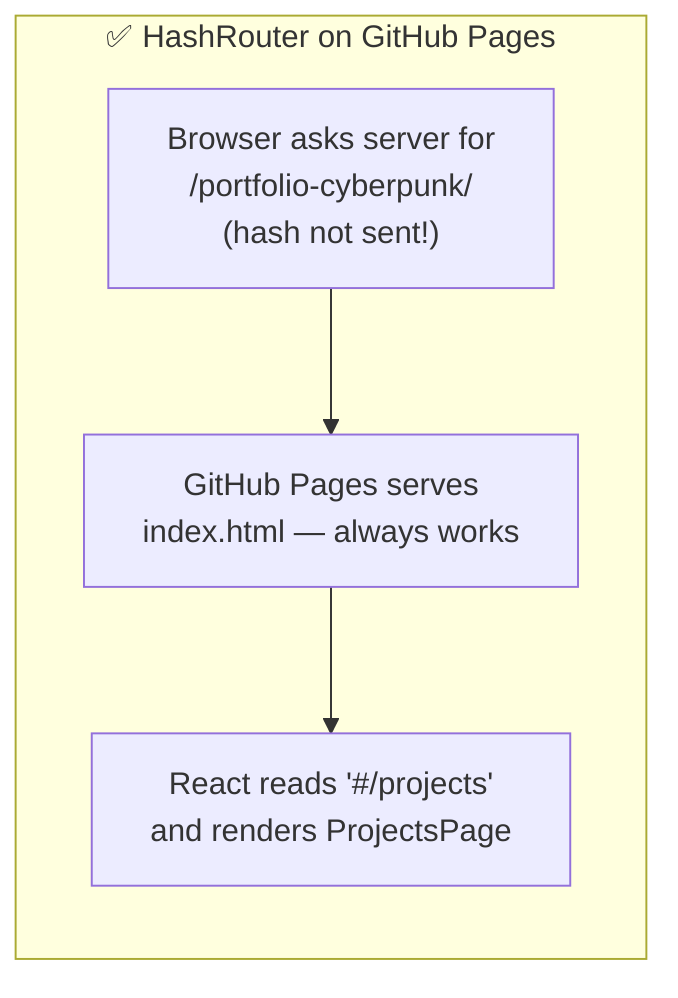

# Chapter 2 — How the App Boots & Routes

## From blank page to rendered site

When a visitor opens the site, this exact chain happens:



The key mental model: **`index.html` is an empty shell.** Everything you see is created by JavaScript after the page loads. That's what "single-page application" (SPA) means.

## The three boot files

### 1. `index.html` — the shell
Contains one important line: `<div id="root"></div>`. React takes over this div.

### 2. `src/main.jsx` — the ignition
```jsx
createRoot(document.getElementById('root')).render(
  <StrictMode>
    <HashRouter>
      <App />
    </HashRouter>
  </StrictMode>,
)
```
Reading inside-out:
- **`<App />`** — your entire application
- **`<HashRouter>`** — wraps the app so any component inside can use routing (links, current-page detection)
- **`<StrictMode>`** — development-only helper that double-runs effects to expose bugs early (does nothing in production)

### 3. `src/App.jsx` — the floor plan
```jsx
<Navbar theme={theme} onThemeToggle={toggle} />   ← always visible
<AnimatePresence mode="wait">
  <Routes location={location} key={location.pathname}>
    <Route path="/"         element={<HomePage />} />
    <Route path="/about"    element={<AboutPage />} />
    <Route path="/skills"   element={<SkillsPage />} />
    <Route path="/projects" element={<ProjectsPage />} />
    <Route path="/contact"  element={<ContactPage />} />
  </Routes>
</AnimatePresence>
<Footer />                                         ← always visible
<ChatBot />                                        ← always visible
```

Navbar, Footer, and ChatBot live **outside** `<Routes>`, so they persist on every page. Only the middle swaps.

`AnimatePresence mode="wait"` is Framer Motion: when the route changes, it lets the old page play its exit animation *before* the new page enters. The `key={location.pathname}` tells React "this is a different page now" so the animation actually triggers.

## The full component tree



Notice `Avatar` and `ProjectModal` appear twice — that's the point of **components**: write once, use anywhere. Changing `Avatar.jsx` updates both the home section *and* the About page.

## Why HashRouter? (the most important 'why' in this codebase)

URLs on this site look like:

```
https://you.github.io/portfolio-cyberpunk/#/projects
                                          ^^
                                          the hash
```

### The problem it solves

With a normal router (**BrowserRouter**), the URL would be `.../portfolio-cyberpunk/projects`. Now imagine a recruiter bookmarks that URL and opens it later:



The route `/projects` only exists *inside your JavaScript* — but the browser asks the **server** for it first, and GitHub Pages has no way to say "just serve index.html for every path" (real servers can; static hosts mostly can't).

### The hash trick

Browsers **never send the `#...` part of a URL to the server.** It's historically for jumping to sections within a page, so it's purely client-side:



**Trade-off:** URLs look slightly less clean (`#/projects` vs `/projects`). For a portfolio on free static hosting, that's a great deal.

### The related gotcha: the base path

In `vite.config.js` the site declares `base: '/portfolio-cyberpunk/'` because GitHub Pages serves project sites from a subfolder, not the domain root. Every asset reference must include it. That's why `config.js` builds paths like:

```js
export const RESUME_PATH = `${import.meta.env.BASE_URL}Resume.pdf`;
// → "/portfolio-cyberpunk/Resume.pdf" in production
// → "/" + "Resume.pdf" in local dev... actually BASE_URL is the same in both
```

`import.meta.env.BASE_URL` is Vite injecting that `base` value — so if you ever rename the repo, you change **one line** in `vite.config.js` and every path follows.

> ⚠️ **Case sensitivity:** locally on Windows, `/artwork.png` finds `Artwork.png`. On the Linux servers GitHub Pages runs, it does **not**. Always match filename case exactly — this bit us once already.

## How navigation actually works

`Navbar.jsx` uses two tools from react-router:

```jsx
import { Link, useLocation } from 'react-router-dom';

const location = useLocation();                 // "what page am I on?"
const isActive = (to) => location.pathname === to;

<Link to="/projects" style={isActive('/projects') ? activeStyle : normalStyle}>
  PROJECTS
</Link>
```

- **`<Link>`** renders an `<a>` tag, but intercepts the click: instead of asking the server for a new page (full reload, white flash), it just updates the URL hash and lets React swap the components. That's why navigation feels instant.
- **`useLocation()`** is a hook that returns the current route — the navbar uses it to highlight the active link in cyan.

**Next:** [Chapter 3 — Styling & Theming →](./03-styling-and-theming.md)
