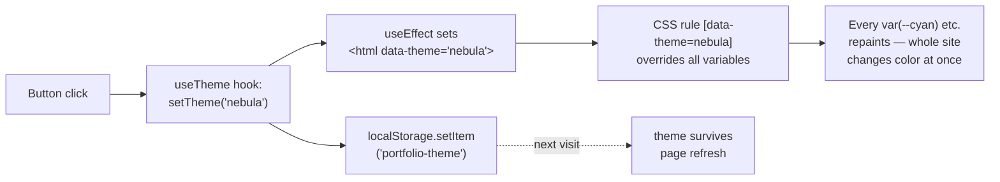

# Chapter 3 — Styling & Theming

This chapter explains the design system: how two entire color themes switch with one button, and how the signature cyberpunk effects (glitch, scanlines, neon) actually work.

## The core idea: CSS variables as a design token layer

Open `src/index.css` and you'll find this at the top:

```css
:root, [data-theme="cyber"] {
  --bg: #030712;          /* page background */
  --surface: #0d1117;     /* card backgrounds */
  --border: #1e2d40;      /* subtle borders */
  --cyan: #00f5ff;        /* PRIMARY accent */
  --magenta: #ff00aa;     /* SECONDARY accent */
  --yellow: #f5e642;      /* highlights */
  --green: #39ff14;       /* status dots */
  --text: #e2e8f0;        /* body text */
  --muted: #4a5568;       /* dim text */
}

[data-theme="nebula"] {
  --bg: #060318;          /* deep indigo instead of near-black */
  --cyan: #a855f7;        /* purple takes over the "primary" slot */
  --magenta: #06d6a0;     /* mint teal takes the "secondary" slot */
  --yellow: #ff6b35;      /* orange highlight */
  /* ...etc */
}
```

**No component ever hardcodes a color.** Every component says `color: var(--cyan)`. So when the theme changes, *every element on the page* updates instantly — without React re-rendering anything. The browser does all the work.



> 📝 A quirk worth knowing: the variable is *named* `--cyan`, but in Nebula theme it *contains purple*. The names really mean "primary accent" / "secondary accent" — they're **semantic slots**, not literal colors. This is a common pattern (and a common naming regret — `--accent-1` would have been more honest).

## The `useTheme` hook (`src/hooks/useTheme.js`)

```js
export function useTheme() {
  const [theme, setTheme] = useState(
    () => localStorage.getItem('portfolio-theme') || 'cyber'   // ① lazy init
  );

  useEffect(() => {                                            // ② side effect
    document.documentElement.setAttribute('data-theme', theme);
    localStorage.setItem('portfolio-theme', theme);
  }, [theme]);                                                 // ③ runs when theme changes

  const toggle = () => setTheme((t) => (t === 'cyber' ? 'nebula' : 'cyber'));
  return { theme, toggle };
}
```

Three ideas packed in here:

1. **Lazy initial state** — `useState(() => ...)` runs the function only on first render, reading the saved theme from `localStorage` so the choice survives refreshes.
2. **`useEffect` for side effects** — touching `document.documentElement` (the `<html>` tag) is outside React's world, so it belongs in an effect.
3. **Custom hook** — this is just a function starting with `use` that itself calls hooks. It packages "theme logic" into one reusable, testable unit. `App.jsx` calls it once and passes `theme`/`toggle` down to the Navbar as props.

## The signature effects, decoded

### 🔦 Scanlines (the CRT-monitor texture over everything)

```css
body::after {
  content: '';
  position: fixed; inset: 0;          /* cover the whole viewport */
  background: repeating-linear-gradient(
    0deg,
    transparent, transparent 2px,      /* 2px of nothing */
    var(--scanline) 2px, var(--scanline) 4px  /* 2px of faint tint */
  );
  pointer-events: none;                /* clicks pass through it */
  z-index: 9999;                       /* on top of everything */
}
```

A `repeating-linear-gradient` alternating "transparent / faintly-tinted" every 2 pixels = horizontal lines across the entire screen. `pointer-events: none` is critical — without it, this invisible overlay would eat every click on the page.

### ⚡ Glitch text (the hero name's flickering ghosts)

The element carries its own text twice more via pseudo-elements:

```css
.glitch-wrapper::before,
.glitch-wrapper::after {
  content: attr(data-text);   /* duplicate the text from the data-text attribute */
  position: absolute; inset: 0;
}
.glitch-wrapper::before { color: var(--cyan);    left:  2px; animation: glitch 3s infinite; }
.glitch-wrapper::after  { color: var(--magenta); left: -2px; animation: glitch 3s infinite; }
```

So there are **three copies** of "Cyrus Neil" stacked: the real one, a cyan ghost shifted right, a magenta ghost shifted left. The `glitch` keyframes then rapidly change `clip-path: inset(...)` — which *crops* each ghost to a random horizontal slice — creating the "broken signal" effect:

```
frame 1:   ▓▓▓▓▓▓▓▓   ← only top slice of cyan ghost visible
frame 2:      ▓▓▓▓▓▓▓▓▓  ← only middle slice, shifted
frame 3:  ▓▓▓        ← bottom slice...
```

### 🎨 Hero artwork glitch (`ArtworkVisual` in `Hero.jsx`)

Same principle, but with **images** and real color-channel splitting:

1. The base `Artwork.png`
2. Two always-on copies filtered to **only their red / only their blue channel** (via SVG `feColorMatrix` filters defined in the JSX) and offset ±3px — this is "chromatic aberration", the lens-fringe look
3. During random "glitch bursts" (a `useEffect` timer flips a `glitching` state every 2.5–6.5s), three more copies appear, each `clip-path`-cropped to a horizontal band and skewed

All copies get a radial `mask-image` so the image *dissolves* into the page background with no hard rectangular edge.

### 💡 Neon glow

There is no "glow" primitive in CSS — it's just shadows that are blurry and colored:

```css
.glow-cyan  { text-shadow: 0 0 8px var(--cyan), 0 0 20px var(--cyan); }
.btn-neon:hover { box-shadow: 0 0 20px var(--cyan); }
```

Two shadows layered (a tight one + a wide one) reads as "glowing tube" to the eye.

### ✂️ Angular corners (buttons, chat bubbles)

No images — `clip-path: polygon(...)` cuts the corners off rectangles:

```css
.btn-neon {
  clip-path: polygon(8px 0%, 100% 0%, calc(100% - 8px) 100%, 0% 100%);
  /*         ↑ start 8px in     ↑ full corner    ↑ end 8px early — a parallelogram */
}
```

## Where styles live (three places, on purpose)

| Location | Used for | Example |
|---|---|---|
| `src/index.css` | Global design system: variables, effects, shared classes | `.btn-neon`, `.glitch-wrapper`, scanlines |
| Inline `style={{...}}` in JSX | Component-specific one-off layout | grid columns, paddings, positions |
| `<style>{`...`}</style>` inside a component | Component-specific rules that inline styles can't express | media queries, `::-webkit-scrollbar`, hover animations |

The rule of thumb this codebase follows: *if two components need it → `index.css`; if it needs a media query or pseudo-selector → component `<style>` block; otherwise → inline.*

**Next:** [Chapter 4 — Components, Sections & Data →](./04-components-and-data.md)
