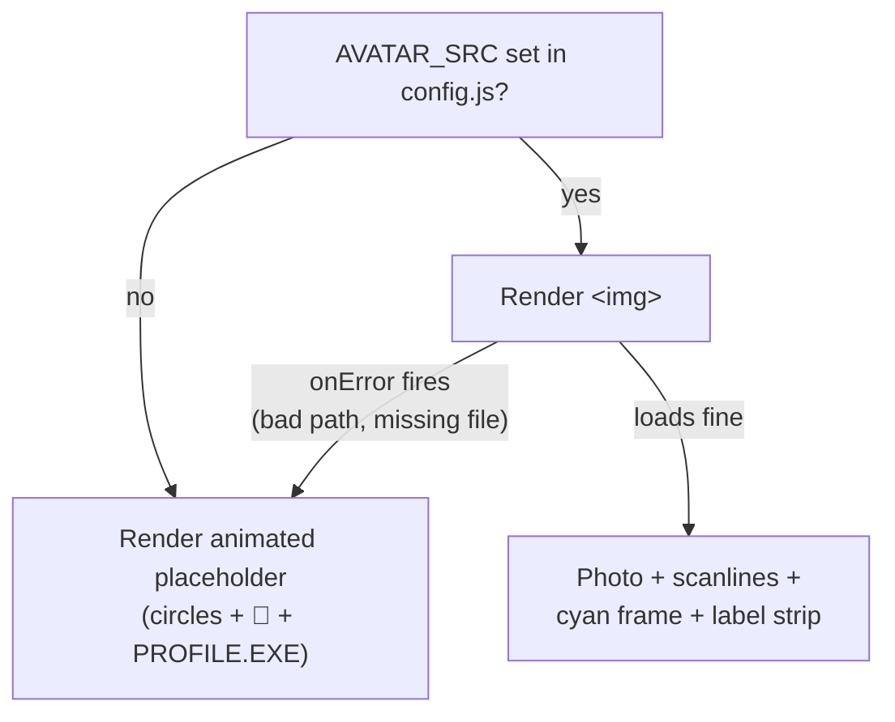

# Chapter 4 — Components, Sections & Data

## Sections vs Pages — the deliberate duplication

The site presents each topic **twice**:

| | `src/sections/` | `src/pages/` |
|---|---|---|
| Where it appears | Stacked on the scrolling home page | Own URL via navbar (`#/about`, …) |
| Depth | Summary / teaser | Expanded (timeline, proficiency bars, form) |
| Animation trigger | `whileInView` — animates when scrolled into view | `animate` — plays immediately on page load |

They intentionally share the same **data files**, so content edits update both at once. But the JSX is separate because the layouts genuinely differ — forcing one component to do both jobs would mean a tangle of `if (isFullPage)` conditions.

## The data layer

All content lives in three plain-JavaScript files. Each exports an array of objects; UI components `.map()` over them.

### `src/data/projects.js`
```js
{
  id: 1,
  title: 'NeuralNet Dashboard',
  description: '...',           // short — shown on cards
  longDescription: '...',       // full — shown in the modal
  tags: ['React', 'Python', 'TensorFlow', 'WebSocket'],
  features: ['...', '...'],     // bullet list in the modal
  image: null,                  // screenshot path, or null → placeholder
  github: '#', live: '#',       // links (null hides the button)
  featured: true,               // true → top "★ FEATURED" section
  status: 'Live', year: '2024', // modal metadata
}
```

### `src/data/skills.js`
Categories (`Languages`, `Frameworks`, `Tools`, `Databases`), each skill carrying its **react-icons component name as a string** (`'SiReact'`) plus its brand color. The components keep an `ICON_MAP` object that turns the string into the real icon component:

```jsx
import { SiReact, SiPython /* ... */ } from 'react-icons/si';
const ICON_MAP = { SiReact, SiPython /* ... */ };
// later:
const Icon = ICON_MAP[skill.icon];   // string → component
<Icon size={32} style={{ color: skill.color }} />
```

Why the indirection? Data files stay **pure data** (no imports, no JSX) — they could be swapped for a JSON API later without changing shape.

> ⚠️ If you add a skill with a new icon, you must add it in **two places**: the data file *and* the `ICON_MAP` (in both `sections/Skills.jsx` and `pages/SkillsPage.jsx`), or the icon renders blank.

### `src/data/socials.js`
Same pattern: name, icon string, `href`, brand color. Rendered by both `sections/Contact.jsx` and `pages/ContactPage.jsx` with per-platform hover colors.

## Component walkthroughs

### `Avatar.jsx` — graceful fallback pattern



The `onError={() => setImgError(true)}` handler means a typo'd filename can never break the page — it just falls back to the placeholder. This *defensive rendering* pattern appears throughout the codebase (chatbot falls back to mock replies, modal shows `NO_PREVIEW.PNG`, …).

### `ProjectModal.jsx` — the terminal popup

State lives in the **parent** (`Projects.jsx` / `ProjectsPage.jsx`):

```jsx
const [selected, setSelected] = useState(null);   // null = closed, project object = open
// card click:  onClick={() => setSelected(project)}
<ProjectModal project={selected} onClose={() => setSelected(null)} />
```

This is called **lifting state up** — the modal doesn't know *which* project it shows; it just renders whatever it's given. Inside, the modal layers several tricks:

- **Boot sequence**: a `useEffect` + `setInterval` reveals fake terminal lines (`$ ssh root@portfolio.dev`, …) one at a time — pure theatre, but it sells the terminal look.
- **Escape-to-close + scroll lock**: another effect adds a `keydown` listener and sets `document.body.style.overflow = 'hidden'`; the cleanup function (the effect's `return`) removes both. *Every effect that adds a listener must clean it up*, or listeners pile up each time the modal opens.
- **Backdrop click closes, panel click doesn't**: the dark backdrop has `onClick={onClose}`, and the panel inside calls `e.stopPropagation()` so clicks on content don't bubble up to the backdrop.
- **`AnimatePresence`** wraps it all so the modal can animate *out* — normally, when React removes a component, it vanishes instantly; AnimatePresence delays removal until the exit animation finishes.

### `Navbar.jsx`
Fixed-position bar that reads `useLocation()` for the active link, gains a blur + border once you scroll 40px (a scroll listener in an effect), collapses to a hamburger under 768px, and hosts the theme toggle (received as props from `App.jsx` — see Chapter 3).

### Framer Motion in 60 seconds

Every animated element is a `motion.*` tag with declarative props:

```jsx
<motion.div
  initial={{ opacity: 0, y: 30 }}        // where it starts
  whileInView={{ opacity: 1, y: 0 }}     // where it ends (when scrolled into view)
  viewport={{ once: true }}              // only animate the first time
  transition={{ delay: index * 0.1 }}    // stagger: card 0 at 0s, card 1 at 0.1s...
  whileHover={{ scale: 1.02, y: -4 }}    // hover lift
>
```

You never write keyframes for these — you declare start/end states and Framer computes the spring physics. The `index * 0.1` stagger trick (used on project cards, skill chips, social icons) is why grids "cascade" in rather than popping all at once.

## The Hero's corner HUD math (a nice trick worth understanding)

The hero content is capped at `max-width: 1500px` and centered. The decorations (year badge, memory dump, scroll cue) are `position: absolute` against the full-width section — so how do they line up with the centered content on a 2560px monitor?

```js
const INSET = 'max(2rem, calc((100% - 1500px) / 2))';
```

- On screens **narrower** than 1500px: `(100% - 1500px)/2` is negative, so `max()` picks `2rem` — normal padding.
- On screens **wider**: the formula computes exactly the leftover margin on each side of the centered container — so `right: INSET` pins the badge flush with the content edge, at any monitor width.

**Next:** [Chapter 5 — UNIT-7: The Chatbot →](./05-chatbot.md)
