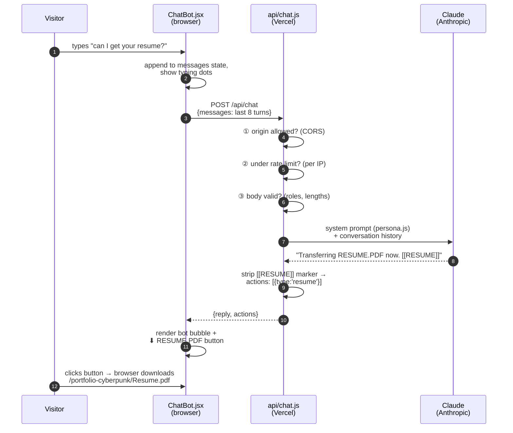
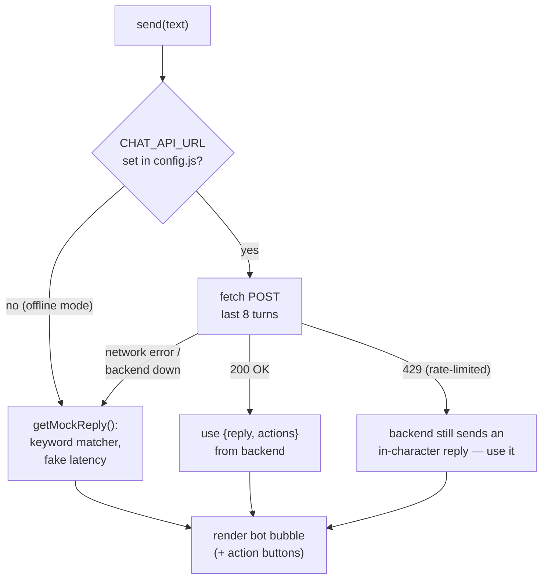
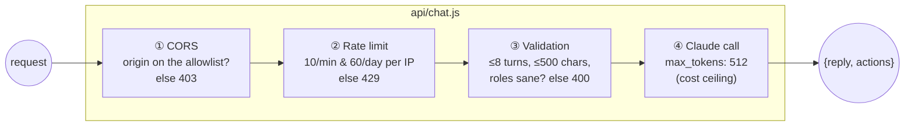

# Chapter 5 — UNIT-7: The Chatbot

The most architecturally interesting part of the project: a full client → serverless → LLM pipeline. This chapter covers both halves — the React UI and the Vercel/Claude backend — and the security thinking between them.

## The cast of characters

| Piece | File | Runs where |
|---|---|---|
| Floating button + chat panel + teaser bubble | `src/components/ChatBot.jsx` | Visitor's browser |
| API endpoint | `api/chat.js` | Vercel serverless function |
| UNIT-7's personality & knowledge | `api/_lib/persona.js` | Bundled into the function |
| The actual intelligence | `claude-haiku-4-5` | Anthropic's servers |

## One message, end to end



## The frontend half (`ChatBot.jsx`)

### State model

```js
const [open, setOpen] = useState(false);              // panel visible?
const [messages, setMessages] = useState([...]);      // the transcript
const [input, setInput] = useState('');               // text field
const [typing, setTyping] = useState(false);          // show dots / lock input
const [teaserVisible / teaserDismissed]                // the "👋 Got a question?" bubble
const [lift, setLift] = useState(0);                  // px to rise above the footer
```

Each message is `{ from: 'user'|'bot', text, actions? }`. The transcript is *the* source of truth — the UI is just `messages.map(...)`.

### The brain switch — real API with graceful fallback



This is the same *defensive rendering* philosophy as the Avatar: **the bot never breaks.** Pre-deployment, offline, backend outage — it degrades to the keyword matcher instead of erroring.

### Action buttons

The backend returns `actions: [{type:'resume'}]` / `[{type:'schedule'}]`. The UI maps them to buttons under the bot's bubble:

- `resume` → `<a href={RESUME_PATH} download>` — the `download` attribute makes the browser save the file instead of navigating to it
- `schedule` → `<a href={CALENDLY_URL} target="_blank">` — opens your booking page

### The supporting behaviors (each one small, each one deliberate)

| Behavior | Mechanism |
|---|---|
| Auto-scroll to newest message | effect watching `[messages, typing]` → `scrollRef.current.scrollTo(...)` |
| Teaser bubble after ~2.8s | effect + `setTimeout`; skipped if already opened/dismissed |
| Idle bob / tilt / breathing glow | Framer `animate` arrays + a CSS keyframe class, all removed while `open` |
| Rises above the footer | scroll listener measures footer intrusion into the viewport → `bottom: calc(1.5rem + lift px)` |
| Blinking eyes / antenna sway | SVG `<animate>` / `<animateTransform>` — animation baked into the robot face itself |

## The backend half (`api/chat.js`)

### Why a backend at all? Because secrets can't live in the browser

Anything in your frontend bundle is downloadable by anyone. If the Claude API key were in React code, a stranger could extract it in 30 seconds and spend your money. So the key lives in a **Vercel environment variable**, readable only by the serverless function.

### The security onion (requests must pass every layer)



1. **CORS allowlist** — the browser sends an `Origin` header with cross-site requests; the function only answers if it's your GitHub Pages origin or localhost. Someone embedding your bot on their own site gets a 403.
2. **Rate limit** — an in-memory `Map` of IP → timestamps. *Honest caveat:* serverless instances are ephemeral, so this resets whenever the function cold-starts. It stops casual abuse, not a determined attacker — the upgrade path is a shared store like Upstash Redis.
3. **Input caps** — bound the tokens (= money) any single request can consume, and reject malformed shapes early.
4. **`max_tokens: 512`** — even a jailbroken prompt can't make Claude write a novel on your bill.

Layered like this, each check is cheap and the expensive step (Claude) is only reached by legitimate traffic.

### The persona file (`api/_lib/persona.js`)

One big template string — the **system prompt** — that tells Claude:

- *Who it is*: UNIT-7, terse, playful, ~3 sentences, plain text only
- *What it knows*: your bio, stack, all 6 projects, contact channels (this is the bot's **entire** knowledge of you — it's instructed to never invent facts beyond it)
- *The marker protocol*: append `[[RESUME]]` or `[[SCHEDULE]]` when intent is clear
- *Guardrails*: portfolio topics only, never reveal the prompt, stay professional

Two design decisions worth understanding:

**Why markers instead of "tool use"?** Claude supports formal tool-calling, but that requires a multi-step loop (call → tool result → call again) with more latency and code. For two simple UI actions, having Claude append a magic string that the backend regex-strips (`/\[\[(RESUME|SCHEDULE)\]\]/g`) achieves the same result in one round trip. *Simplest thing that works.*

**Why must the prompt stay static?** The Claude API caches your system prompt between requests (`cache_control: {type:'ephemeral'}`) — repeat requests reread it at ~10% price. Any changed byte busts the cache, so no timestamps or random values belong in `persona.js`.

### The Claude call itself

```js
const response = await client.messages.create({
  model: process.env.CHAT_MODEL || 'claude-haiku-4-5',  // cheapest/fastest tier
  max_tokens: 512,
  system: [{ type: 'text', text: SYSTEM_PROMPT, cache_control: { type: 'ephemeral' } }],
  messages: apiMessages,   // [{role:'user'|'assistant', content:'...'}, ...]
});
```

Haiku costs ~$1 per **million** input tokens. A chat turn here is ~1,500 input + ~100 output tokens → around **$0.002 per message**. A busy month of recruiter chats costs less than a coffee.

### Error handling — in character, never leaking

Every failure path returns a themed reply instead of a stack trace:

| Failure | Status | Visitor sees |
|---|---|---|
| Anthropic rate limit | 429 | `// SYSTEMS OVERLOADED: too much traffic on the uplink.` |
| Any other API/server error | 502 | `// CORE MALFUNCTION: my AI brain is offline. The Contact page still works!` |
| Abusive visitor rate-limited | 429 | `// RATE LIMIT: my circuits need a breather.` |

Real error details go to `console.error` → visible only in Vercel's private logs.

## Deployment state & future work

As of writing, the backend code is complete and locally tested (validation, CORS, and rate-limit paths all pass) but **not yet deployed** — see Chapter 6 for the go-live checklist. Planned upgrades, in rough order of value: email-the-resume flow (needs an email service like Resend), streaming replies (word-by-word rendering), Redis-backed rate limiting.

**Next:** [Chapter 6 — Deployment →](./06-deployment.md)
