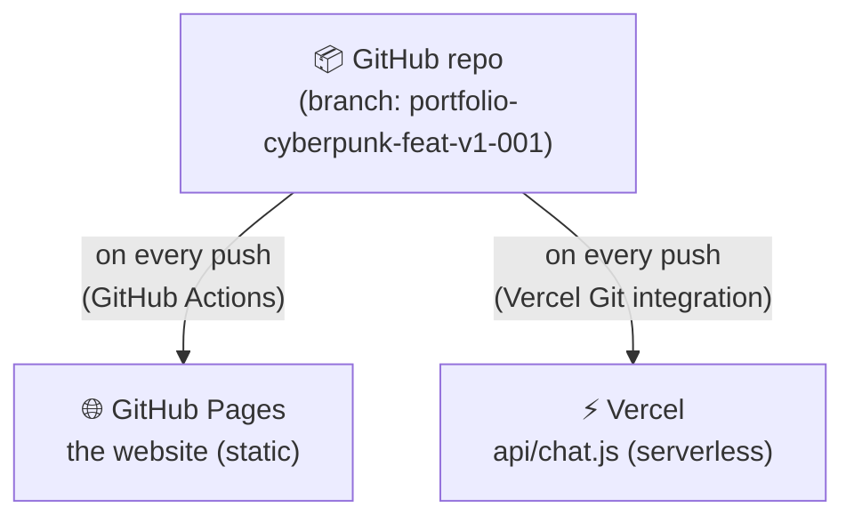
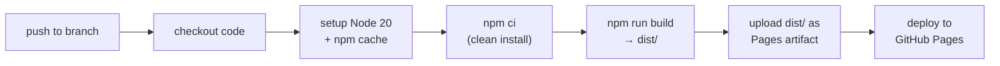
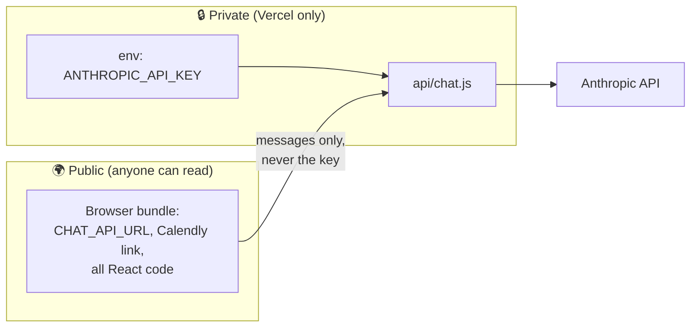

# Chapter 6 — Deployment

Two independent deployments, one repo:



## Part A — the site on GitHub Pages

### What the workflow does (`.github/workflows/deploy.yml`)



Every push to `portfolio-cyberpunk-feat-v1-001` triggers this automatically. `npm ci` (instead of `npm install`) installs *exactly* what `package-lock.json` specifies — reproducible builds. `npm run build` invokes Vite, which:

1. Bundles all `src/` into a few minified files with **hashed names** (`index-CsBhwgUE.js`)
2. Copies `public/` verbatim into `dist/`
3. Rewrites asset URLs to include the base path

The hash in filenames is cache-busting: browsers can cache aggressively because any code change produces a *different filename*.

### What `dist/` looks like

```
dist/
├── index.html                  ← tiny shell pointing at the hashed bundle
├── assets/
│   ├── index-CsBhwgUE.js       ← the entire React app, minified (~490 KB / 155 KB gzipped)
│   └── index-D2f0abc.css
├── Artwork.png, Apex.gif, ...  ← public/ copied as-is
```

### The three production gotchas (memorize these)

| Gotcha | Symptom | Fix |
|---|---|---|
| **Base path** — site lives at `/portfolio-cyberpunk/`, not `/` | Assets 404 in production but work locally | Always build URLs with `import.meta.env.BASE_URL`; never hardcode `/something.png` |
| **Case sensitivity** — GitHub Pages runs on Linux | Image loads on Windows dev, broken in production | Match filename case exactly (`Artwork.png` ≠ `artwork.png`) |
| **No server routing** | Deep links 404 with BrowserRouter | We use HashRouter (`#/about`) — see Chapter 2 |

## Part B — the backend on Vercel

### One-time setup (the go-live checklist)

1. **Create the Vercel project**: [vercel.com](https://vercel.com) → *Add New → Project* → import this GitHub repo → set the production branch to `portfolio-cyberpunk-feat-v1-001`. `vercel.json` already tells Vercel to skip the frontend build and only deploy `api/`.
2. **Add the secret**: Project → *Settings → Environment Variables* →
   `ANTHROPIC_API_KEY = sk-ant-...` (create the key at [console.anthropic.com](https://console.anthropic.com); the account needs billing enabled — expected spend at portfolio traffic: well under $1/month).
   Optionally `CHAT_MODEL` to override the default `claude-haiku-4-5`.
3. **Connect the frontend**: copy the deployment URL and set it in [`src/config.js`](../src/config.js):
   ```js
   export const CHAT_API_URL = 'https://<your-project>.vercel.app/api/chat';
   ```
4. **Check the CORS allowlist** in [`api/chat.js`](../api/chat.js) — `ALLOWED_ORIGINS` must contain your real GitHub Pages origin (scheme + domain, **no path**): `https://<username>.github.io`.
5. **Assets**: drop `Resume.pdf` into `public/`, and put your real Calendly/Cal.com link in `CALENDLY_URL` in `config.js`.
6. Push — both deployments update; test the bot on the live site.

### How a serverless function differs from a server

| | Traditional server | Vercel function |
|---|---|---|
| Running | 24/7, you pay for idle | Spun up per request, dies after |
| State | Keeps memory between requests | Memory resets on cold start ⚠️ |
| Scaling | You manage it | Automatic |
| Cost at low traffic | Fixed monthly | Effectively $0 |

That ⚠️ is why the rate limiter's in-memory `Map` is "best effort" — a cold start wipes it. Fine for a portfolio; a production product would use an external store (Upstash Redis).

### Secrets flow (why the key is safe)



Rule of thumb: **anything prefixed `VITE_` or imported into `src/` ships to every visitor.** Secrets only ever go in Vercel/hosting environment variables and are only read by `api/` code.

## Local development commands

| Command | What it does |
|---|---|
| `npm run dev` | Vite dev server at `localhost:5173` with hot reload |
| `npm run build` | Production build into `dist/` — run before pushing to catch errors |
| `npm run preview` | Serve the built `dist/` locally (closest thing to production) |
| `npx vercel dev` | Runs the site *and* `api/` functions locally (needs `vercel login` once; put `ANTHROPIC_API_KEY` in a `.env` file — which is gitignored) |

**Next:** [Chapter 7 — React Concepts Used Here →](./07-react-concepts.md)
