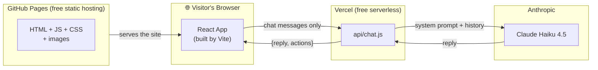

# 📚 Portfolio Documentation

> A complete, learning-oriented guide to how this cyberpunk portfolio works — from the moment the browser loads the page to the moment UNIT-7 answers a recruiter's question.

This documentation is written for **you, the owner**, to actually understand the codebase — not just use it. Every chapter explains *what* was built, *how* it works, and most importantly *why* it was done that way.

> 💡 **Diagrams:** All diagrams use [Mermaid](https://mermaid.js.org/), which GitHub renders as real visual diagrams automatically. View these files on github.com (or in VS Code with the Mermaid preview extension) to see them drawn. In a plain text editor you'll see the diagram source code instead.

---

## Chapters

| # | Chapter | What you'll learn |
|---|---------|-------------------|
| 1 | [The Big Picture](./01-overview.md) | Full architecture, tech stack, repository map, how the pieces connect |
| 2 | [How the App Boots & Routes](./02-boot-and-routing.md) | `main.jsx` → `App.jsx`, the component tree, HashRouter and *why* it's needed |
| 3 | [Styling & Theming](./03-styling-and-theming.md) | CSS variables, the two themes, the theme toggle, glitch/scanline/neon effects |
| 4 | [Components, Sections & Data](./04-components-and-data.md) | Sections vs pages, the data files, the project modal, Framer Motion animations |
| 5 | [UNIT-7: The Chatbot](./05-chatbot.md) | The full stack — floating UI, the Vercel backend, Claude API, security layers |
| 6 | [Deployment](./06-deployment.md) | GitHub Pages CI/CD, the base-path gotcha, Vercel backend deploy |
| 7 | [React Concepts Used Here](./07-react-concepts.md) | Every React idea in this codebase, explained with examples *from this codebase* |

---

## Suggested reading order

**If you're new to React** → read 7 first, then 1 → 2 → 3 → 4 → 5 → 6.

**If you know React basics** → 1 → 2 → 5 (the chatbot is the most interesting architecture) → skim the rest as reference.

**If something breaks** → chapter 6 covers the deployment gotchas that cause 90% of "it works locally but not in production" problems.

---

## The 10-second summary

The site itself is **100% static** — plain files served by GitHub Pages. The *only* server code is the chatbot's brain, which lives on Vercel so the Claude API key never touches the browser.
